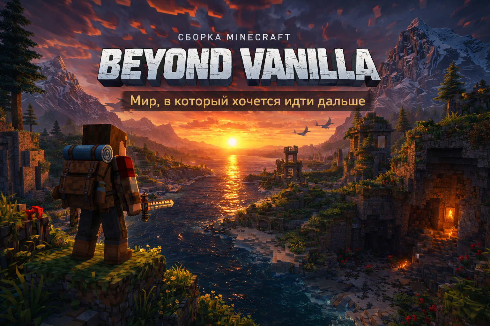

  

<h1 align="center">Beyond Vanilla</h1>
<h3 align="center">Мир, в который хочется идти дальше</h3>

  <b>Beta Version</b> • Сборка находится в активной разработке и тестировании

  Атмосферная <b>Vanilla+</b> сборка для Minecraft, сделанная вокруг исследования, красивого мира,
  удобного геймплея и ощущения настоящего путешествия.

  <b>Recommended Launcher:</b> ElyPrismLauncher

  
  
  
  
  

  <a href="INSTALL.md">⚙️ Установка</a>
  •
  <a href="FAQ.md">❓ FAQ</a>
  •
  <a href="MODS.md">🧩 Моды</a>
  •
  <a href="TROUBLESHOOTING.md">🛠 Troubleshooting</a>

---

## 🚧 Важно: это **бета-версия**

**Beyond Vanilla** сейчас находится в стадии **Beta**.

Это значит:

> ⚠️ В сборке могут быть баги, вылеты и недоработки.  
> ⚠️ Некоторые моды, настройки и баланс ещё могут изменяться.  
> ⚠️ После будущих обновлений может потребоваться новый мир.  
> ⚠️ Это не финальный релиз, а тестовая версия проекта.

**Бета открыта для тестирования**, сбора фидбека и поиска проблем до полноценного релиза.

---

## ❗ Важно: запускать только через **ElyPrismLauncher**

**Сборка должна запускаться только через ElyPrismLauncher.**

> Открывать сборку в других лаунчерах **не рекомендуется**.  
> Корректная работа, установка и запуск гарантируются только в **ElyPrismLauncher**.

Если ты решил открыть её где-то ещё, а потом словил ошибки, конфликты, неправильную установку или кривой запуск, то это уже не проблема сборки, а проблема запуска вне рекомендуемого лаунчера.

---

## О сборке

**Beyond Vanilla** — это не попытка превратить Minecraft в другой жанр.  
Это сборка, которая делает ванильный опыт **глубже, красивее и интереснее**, не перегружая игру случайным мусором.

Здесь мир выглядит так, будто **в него реально хочется идти дальше**:

- дальше по хребтам и берегам
- дальше к руинам и древним местам
- дальше в пещеры, леса и забытые маршруты
- дальше просто потому, что за горизонтом снова видно что-то интересное

> **Beyond Vanilla** не про  
> “смотрите, сколько тут модов”,  
> а про  
> **“ещё немного пройду и выйду...”**  
> ...а потом ты уже чёрт знает где через 2 часа.

---

## ✨ Особенности сборки

### 🌍 Мир и исследование
- более выразительная генерация мира
- длинные маршруты и красивые виды
- руины, структуры, древние места и точки интереса
- исследование, которое ощущается как путешествие, а не как бег до ближайшей шахты

### ⚔️ Выживание и боёвка
- улучшенная боёвка
- чуть более интересный темп выживания
- больше причин выходить за пределы базы
- исследование вознаграждает не только лутом, но и самим ощущением пути

### 🎒 Удобство
- quality-of-life улучшения, после которых тяжело возвращаться в голую ванилу
- удобный интерфейс
- полезные мелочи для инвентаря, исследования и повседневной игры
- оптимизационная база для более стабильной работы

### 🌲 Атмосфера
- звуки, детали, визуальные улучшения и анимации
- более живой мир без лишней перегрузки
- аккуратный **Vanilla+ вайб** без ощущения, что игра разваливается на сто разных модов

---

## 🧭 Для кого эта сборка

**Beyond Vanilla** подойдёт, если тебе хочется:

- красивый и большой мир
- спокойную, но затягивающую атмосферу
- больше интереса к исследованию
- удобный Minecraft без лишней духоты
- цельную **Vanilla+** сборку

Если тебе нужен лютый RPG-хардкор, классы, тонны магии и постоянная боль — это не сюда.  
Если нужен **Minecraft, в который хочется играть дольше обычного** — ты по адресу.

---

## 🚧 Скачать бету

В **Beyond Vanilla Beta** уже можно поиграть прямо сейчас.

### Ссылки на скачивание:
- [MEGA][ССЫЛКА_НА_MEGA]
- [Google Drive][ССЫЛКА_НА_GOOGLE_DRIVE]
- [Яндекс Диск][ССЫЛКА_НА_YANDEX_DISK]

### Перед запуском:
- устанавливай и запускай сборку **только через ElyPrismLauncher**
- для корректной генерации мира **создай новый мир**
- не смешивай сборку с левыми модами без необходимости

> ⚠️ Бета-версии могут обновляться быстро.  
> Некоторые будущие изменения могут повлиять на стабильность и совместимость сохранений.

---

## 📚 Навигация

- [⚙️ Установка](INSTALL.md)
- [❓ FAQ](FAQ.md)
- [🧩 Список модов](MODS.md)
- [🛠 Устранение неполадок](TROUBLESHOOTING.md)
- [📝 История изменений](CHANGELOG.md)
- [⚠️ Дисклеймер](DISCLAIMER.md)
- [⚖️ Лицензия](LICENSE.md)

---

## ⚠️ Важная информация

> Сборка тестируется как единый проект.  
> Добавление своих модов, ресурспаков, шейдеров или изменение части настроек может повлиять на стабильность и генерацию мира.

### Что можно делать спокойно:
- менять базовые игровые настройки
- настраивать управление и интерфейс под себя
- отключать необязательные визуальные эффекты

### Что лучше не делать без понимания:
- запускать сборку вне **ElyPrismLauncher**
- докидывать worldgen-моды в уже готовую сборку
- продолжать старые миры после крупных изменений генерации
- смешивать версии модов от разных веток Minecraft

---

## 🧪 Зачем открыта бета

Бета нужна, чтобы:

- проверить стабильность сборки на разных системах
- собрать фидбек по балансу, атмосфере и удобству
- найти баги до полноценного релиза
- доработать сборку на основе реального опыта игроков

Если ты нашёл проблему или хочешь поделиться мнением — это действительно полезно.

---

## 🐞 Нашёл баг?

Если словил вылет, конфликт или странную генерацию мира:

1. Сначала загляни в [TROUBLESHOOTING.md](TROUBLESHOOTING.md)
2. Проверь, не менял ли ты состав модов вручную
3. Убедись, что запускаешь сборку именно через **ElyPrismLauncher**
4. Если проблема осталась — напиши в Telegram или создай issue

### При баг-репорте полезно приложить:
- версию сборки
- версию Minecraft
- лог или crash-report
- краткое описание проблемы
- скриншот, если он помогает понять баг

---

## 🚀 С чего начать

1. Скачай сборку по одной из ссылок  
2. Открой её через **ElyPrismLauncher**  
3. Создай **новый мир**  
4. Не спеши с выводами по первым минутам  
5. Просто иди дальше

---

## 💬 Сообщество и поддержка

  <a href="https://t.me/budovv_studio?direct">
     
    <b>Telegram-сообщество Budovv Studio</b>
  </a>

В Telegram вы можете:
- задать вопрос по сборке
- получить помощь
- сообщить о баге
- следить за обновлениями
- общаться с сообществом

---

## 📦 Текущая версия

- **Beyond Vanilla:** `v0.1 Beta`
- **Minecraft:** `1.21.x`
- **Loader:** `Fabric`
- **Launcher:** `ElyPrismLauncher`
- **Status:** `Beta`

История изменений:
- [CHANGELOG.md](CHANGELOG.md)

---

## ⚖️ Юридическая информация

- [Лицензия](LICENSE.md)
- [Дисклеймер](DISCLAIMER.md)

---

  © BUDHAAAAA / Beyond Vanilla

  © BUDHAAAAA / Beyond Vanilla

